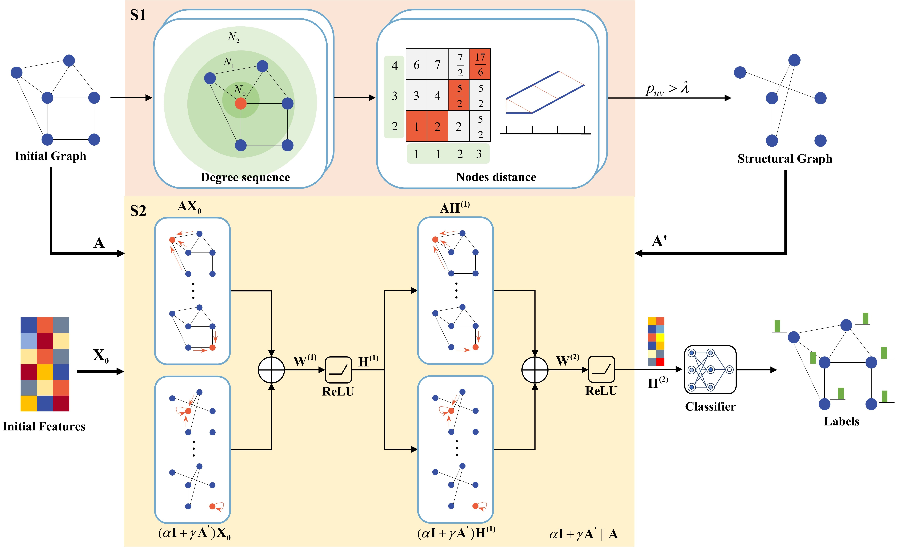

# StrucGCN

A **PyTorch** implementation of StrucGCN **"StrucGCN: Structural Enhanced Graph Convolutional Networks for Graph Embedding"**. (INFUS 2024)

## Abstract

In graph embedding, many popular Graph Neural Networks (GNNs) rely on node features and the adjacency matrix to achieve local feature representations, which limits their ability to capture intricate structural information and long-range node dependencies. This weakness is particularly evident in heterophily graphs. To address this issue, we propose a novel, simple, and efficient graph learning framework based on Graph Convolutional Networks (GCN), called structural enhanced graph convolutional networks (StrucGCN). The proposed algorithm constructs a structural matrix based solely on topological similarity, independent of node features and labels. The sparse and highly similar structural matrix enables the model to learn more structural information, facilitating non-local aggregation and making it suitable for graphs without initial features. During message passing, we improve the model by adopting both mean and concatenation operations, allowing nodes to achieve better fusion of self-features, neighbor features, and structural features while maintaining training efficiency. Additionally, we analyze the quality of initial features and the adjacency matrix across different graph datasets to guide the design of the message passing. Experiments on 9 benchmark datasets, both with and without initial features, demonstrate the high performance, efficiency, and broad applicability of StrucGCN compared to state-of-the-art algorithms.

## Framework



## Dependencies

- python 3.10.8
- pytorch 2.1.2
- torch-geometric 2.5.3

## Run

```
python main.py
```

## ## Citation

```

```
